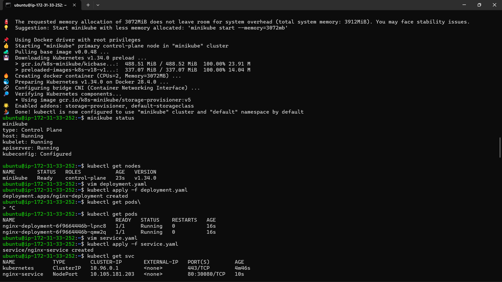
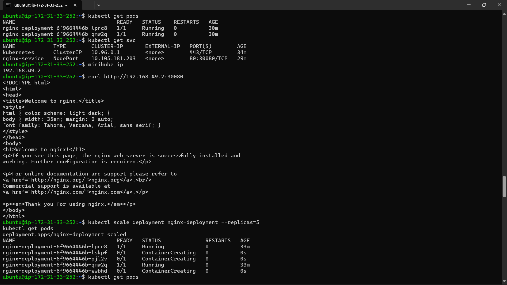
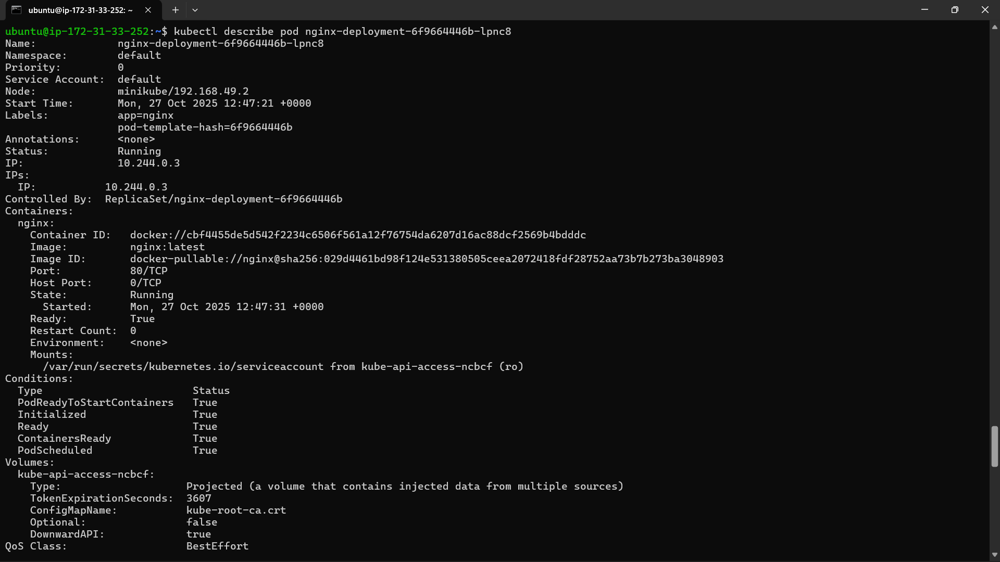

# Kubernetes Deployment using Minikube

This project demonstrates the setup and deployment of a sample application in a Kubernetes cluster using Minikube.
The project involves creating and managing Kubernetes deployments, services, and scaling operations to showcase basic container orchestration concepts.
## Features

- Creation of a local Kubernetes cluster using Minikube

- Deployment of a sample Nginx application using YAML files

- Exposure of the deployment using a Kubernetes Service

- Verification of pods and services

- Scaling the deployment to multiple replicas

- Retrieval of logs and resource descriptions

## Tech Used

- Kubernetes

- Minikube

- Docker

- kubectl

## Installation

**Step 1:** Start Minikube
```bash
minikube start
```

**Step 2:** Verify Cluster Status
```bash
kubectl get nodes
```

**Step 3:** Create Deployment

- Apply the deployment YAML file:
```bash
kubectl apply -f deployment.yaml
```
**Step 4:** Expose Deployment via Service

- Apply the service YAML file:
```bash
kubectl apply -f service.yaml
```
**Step 5:** Verify Running Pods and Services
```bash
kubectl get pods
kubectl get services
```
**Step 6:** Access the Application

- Get the service URL using:
```bash
minikube service nginx-service --url
```

### Scaling Deployment

- To scale the deployment to 5 replicas:
```bash
kubectl scale deployment nginx-deployment --replicas=5
```
- Check updated pods:
```bash
kubectl get pods
```
### Logs and Descriptions

- To view detailed information and logs:
```bash
kubectl describe pod <pod-name>
kubectl logs <pod-name>
```

## Screenshots


Below are the screenshots captured during the execution of Kubernetes Task.

### 1. Minikube Setup and Cluster Verification
This screenshot shows the successful start of Minikube along with the verification commands:
- `minikube status`
- `kubectl get nodes`
- `kubectl get pods`
  


### 2. Service Exposure and Scaling
This screenshot includes:
- `kubectl get svc` showing the NodePort service
- `curl` command verifying the Nginx page response
- `kubectl scale deployment nginx-deployment --replicas=3` confirming scaling of pods
  


### 3. Describing Deployment
This screenshot shows the use of:
- `kubectl describe deployment nginx-deployment`
to view detailed information about the deployment.
  



